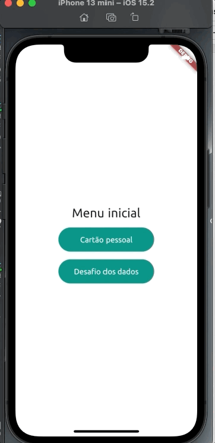
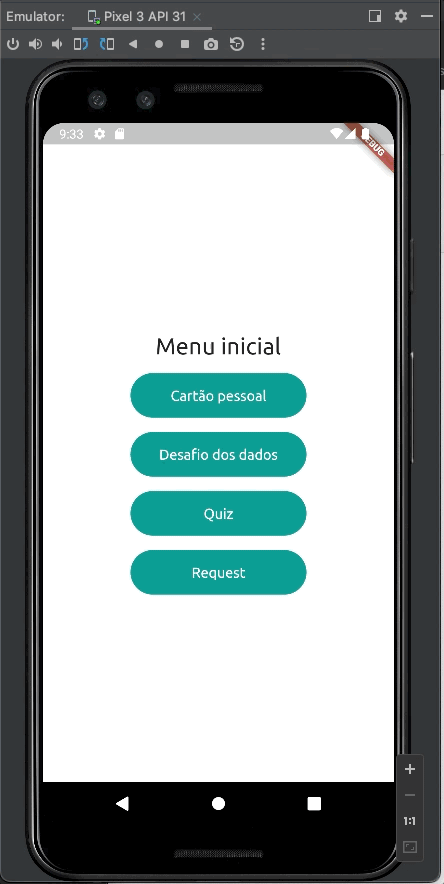
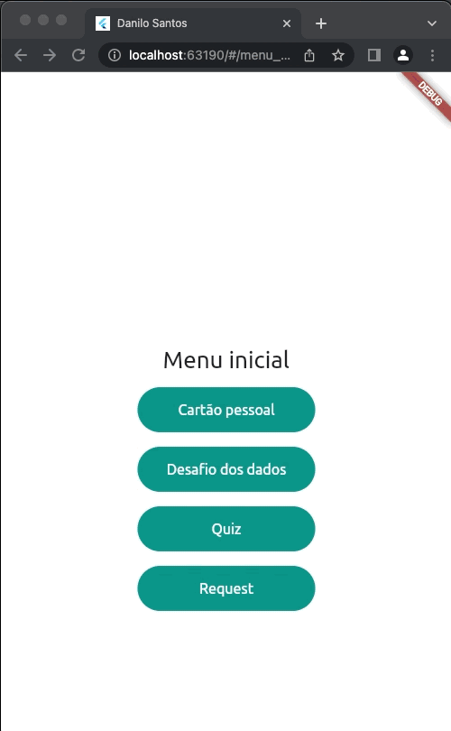

# Fiap MBI course 

Introduction to Flutter;

## Description

Fully didactic purposes for the [Fiap MBI course](https://www.fiap.com.br/)

## Preview

| Iphone 13 Mini | Pixel 3 | Chrome |
| ---- | ---- |  ---- |
|  |  | 

## Authors

[Danilo Santos](https://www.linkedin.com/in/danilopsnts/)

## Contributing

Please read [CONTRIBUTING](CONTRIBUTING.md) for details on our code of conduct, and the process for submitting pull requests to us.
## License

This project is licensed under the MT License - see the [LICENSE](LICENSE.md) file for details
